Crop Analysis Q3 2013
================
John Smith
May 3rd, 2014

``` r
# Class 5 - Data Visualization

x <- rnorm(1000)

# Command + Return (while on line(s) of interest) will run the code 

# How  many things are in x
length(x)
```

    ## [1] 1000

``` r
mean(x)
```

    ## [1] -0.00989136

``` r
sd(x)
```

    ## [1] 0.9971839

``` r
# Summary statistics
summary(x)
```

    ##      Min.   1st Qu.    Median      Mean   3rd Qu.      Max. 
    ## -3.945700 -0.677818  0.013704 -0.009891  0.687649  2.821954

``` r
# Different graphs
boxplot(x)
```

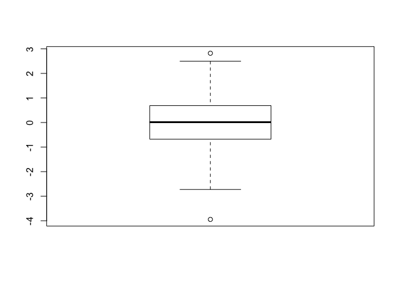<!-- -->

``` r
hist(x)
rug(x)
```

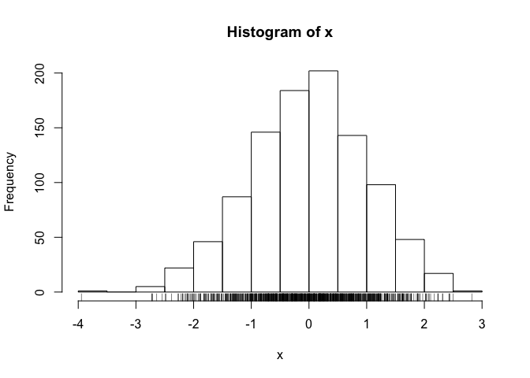<!-- -->

``` r
# Alphabetical almost always a bad way of presenting data 
# The only thing worse than a pie chart is several of them

# Section2
weight <- read.table("bimm143_05_rstats/weight_chart.txt", header = TRUE)
plot(weight$Age, weight$Weight, type = "o", pch = 15, col = "blue", xlab = "Age (months)", ylab = "Weight (kg)", main = "Baby Weight With Age", ylim=c(2,10))
```

<!-- -->

``` r
mouse <- read.delim("bimm143_05_rstats/feature_counts.txt")
                    
                    
# Plotting labels - xlab, ylab, main = "label"
# Different read functions premade with different parameters (read.table, read.delim etc)

# Set parameters before plotting data
par(mar=c(3.1, 11.1, 4.1, 2))
barplot(mouse$Count, horiz = TRUE, names.arg = mouse$Feature, main = "TITLE", las = 1, xlim=c(0,80000))
```

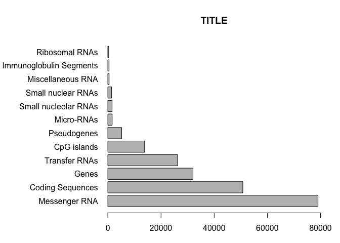<!-- -->

``` r
x <- c(rnorm(10000), rnorm(10000)+4)
hist(x, breaks = 50)
```

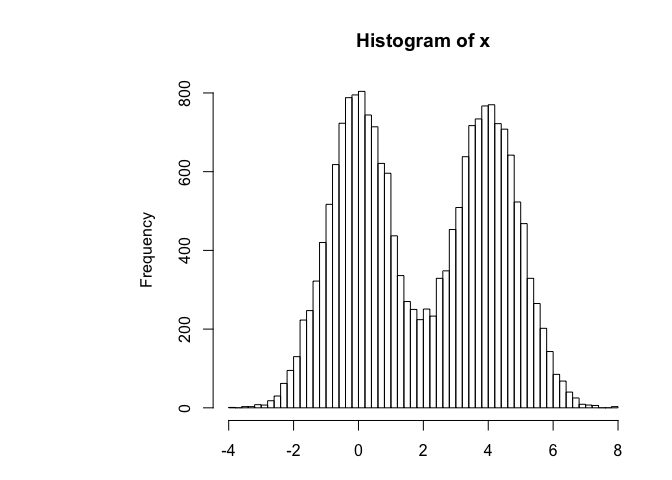<!-- -->

``` r
# Use delim function b/c sep = \tab between variables of interest
# par(mar=c(bottom, left, top, right))
par(mar=c(7,5,6,3))
MF <- read.delim("bimm143_05_rstats/male_female_counts.txt")
barplot(MF$Count, col=rainbow(nrow(MF)), names.arg = MF$Sample, las=2, ylab="Counts")
```

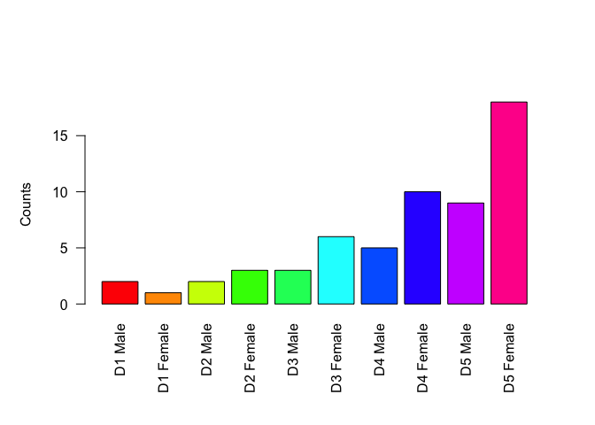<!-- -->

``` r
# col=rainbow(nrow(MF))

# vector recycling -- will go B/R/B/R
barplot(MF$Count, names.arg = MF$Sample, las=2,col=c("blue", "red"), main="Counts")
```

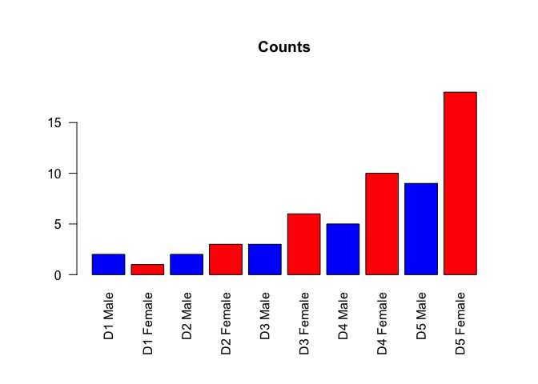<!-- -->

``` r
genes <- read.delim("bimm143_05_rstats/up_down_expression.txt")
nrow(genes)
```

    ## [1] 5196

``` r
table(genes$State)
```

    ## 
    ##       down unchanging         up 
    ##         72       4997        127

``` r
par(mar=c(5,5,5,3))
plot(genes$Condition1, genes$Condition2, col=genes$State, 
     xlab="Expression condition 1", ylab="Expression condition 2") 
```

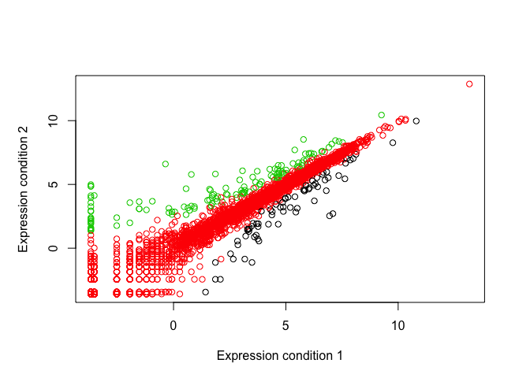<!-- -->

``` r
palette()
```

    ## [1] "black"   "red"     "green3"  "blue"    "cyan"    "magenta" "yellow" 
    ## [8] "gray"

``` r
levels(genes$State)
```

    ## [1] "down"       "unchanging" "up"

``` r
# Define the palette you want to use
palette(c("red", "grey", "blue"))
plot(genes$Condition1, genes$Condition2, col=genes$State, 
     xlab="Expression condition 1", ylab="Expression condition 2")
```

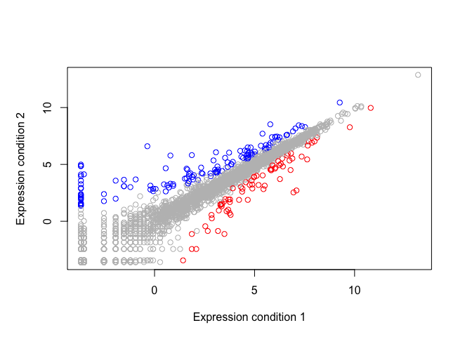<!-- -->

``` r
meth <- read.delim("bimm143_05_rstats/expression_methylation.txt", row.names = 1)

# Number of genes in this set
nrow(meth)
```

    ## [1] 9241

``` r
dcols2 <- densCols(meth$gene.meth, meth$expression)
plot(meth$gene.meth, meth$expression, col= dcols2, pch=20)
```

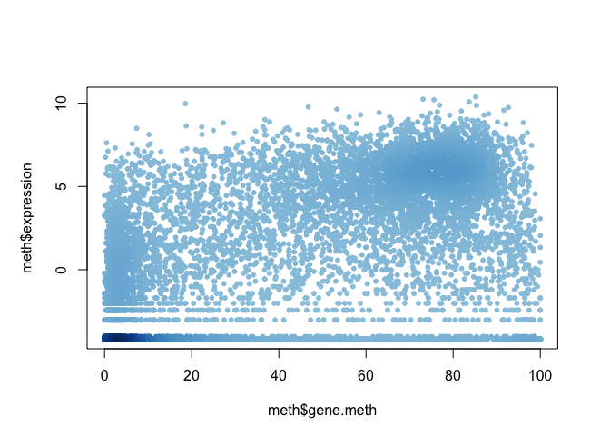<!-- -->

``` r
inds <- meth$expression > 0
dcols2 <- densCols(meth$gene.meth[inds], meth$expression[inds])

plot(meth$gene.meth[inds], meth$expression[inds], col=dcols2, pch=20)
```

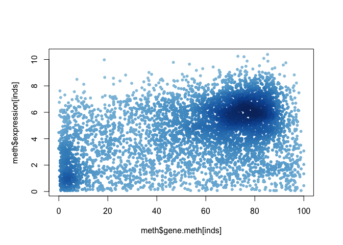<!-- -->

``` r
dcols3 <- densCols(meth$gene.meth[inds], meth$expression[inds],
                   colramp = colorRampPalette(c("blue2",
                                                "green2",
                                                "red2",
                                                "yellow2")))

plot(meth$gene.meth[inds], meth$expression[inds], col=dcols3, pch=20)
```

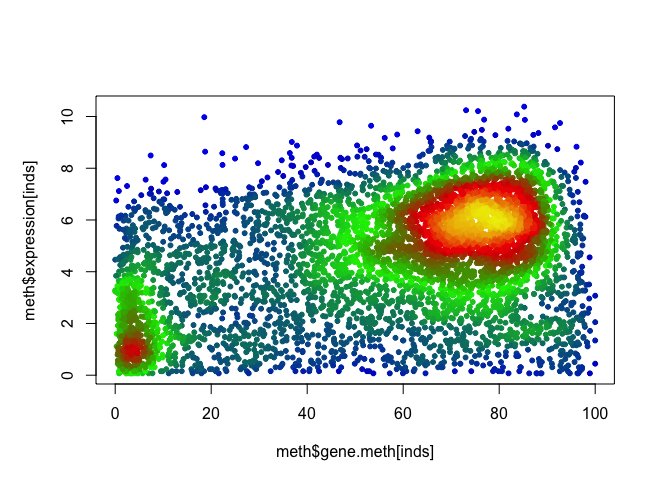<!-- -->
